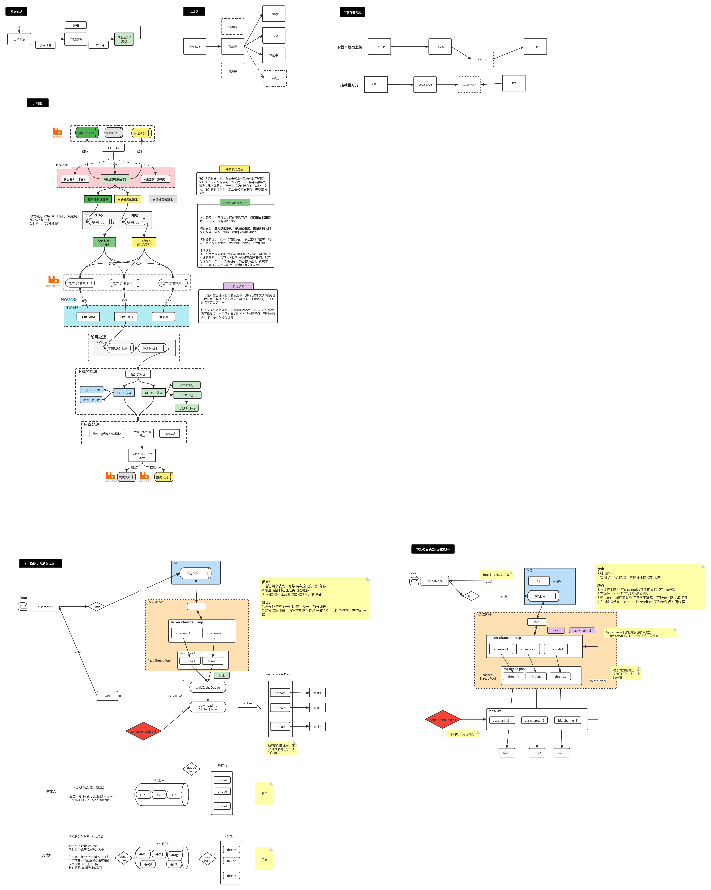

# x-downloader 分布式多任务下载器

#### 介绍
x-downloader 是一款分布式下载器，目前支持HTTP、FTP 文件下载（其中集成了m3u8文件的下载）。本下载器基于nacos和rabbitmq中间件，采用调度和分配策略，结合生产者消费者模型，
天然支持动态调整下载速率(同时下载文件数)、查看下载进度、优先级下载(mq+内部优先队列)、断点下载、动态横向扩容(增加下载节点)等功能。
#### 架构
架构说明



#### 使用说明

任务参数说明

```json
{
	 timestamp: 1600000000, //时间戳 
	 task: { //下载任务
		id: 1001, //任务id     
		retryCount: 0, //重试次数   
		sourceFtpUrl: "ftp://xxx", //源FTP地址 
		targetFtpUrl: "ftp://ttt", //目标FTP地址     
		fileType: 1, //文件类型     
		priority: 10, //优先级     
		notifyUrl: "http://servername/callback/xxx", //通知地址     
		fileCode: "BDNxxx", //文件code     
		status: 1 ,//下载任务状态     
		startTime: 160000, //下载开始时间     
		finishTime: 160000, //下载完成时间     
		duraltion: 10000, //下载持续时常     
		taskServerInstanceId: "ip + port + xx" //nacos 组件唯一id 
	}
}
```


#### 参与贡献


#### 下个版本解决的问题
1.【downloader】下载节点异常时，缺少一个 队列剩余任务 自动再分配的处理
2.【dispatcher】下载节点异常时，缺少一个 重试任务队列 自动再分配的处理
3.【dispatcher】在不依赖xxljob的情况下，现有方案还不够完美
4.缺少一个全任务流程追踪的可视化过程
